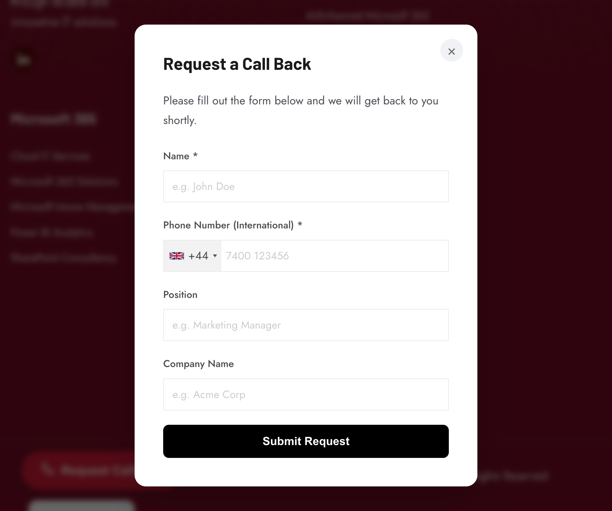
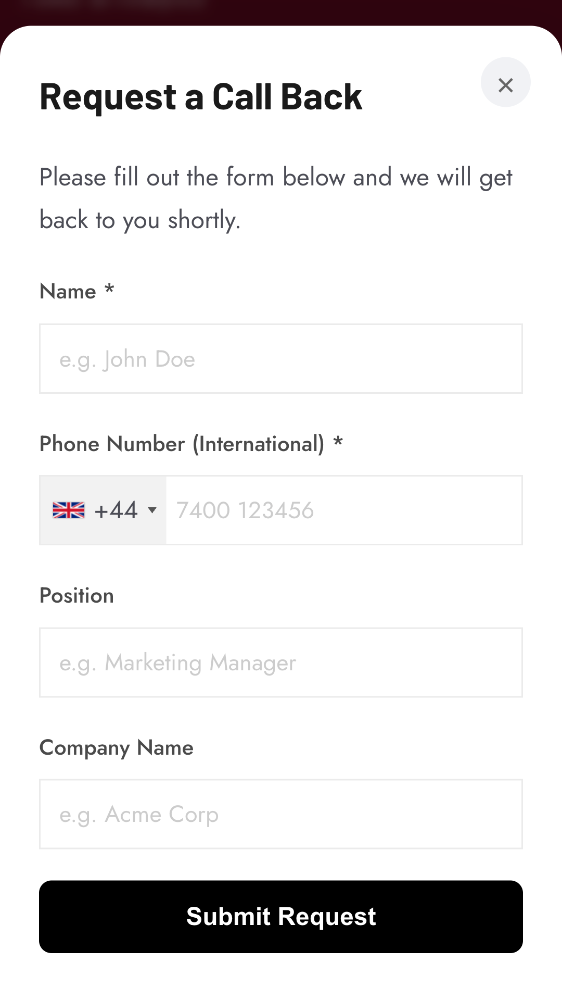
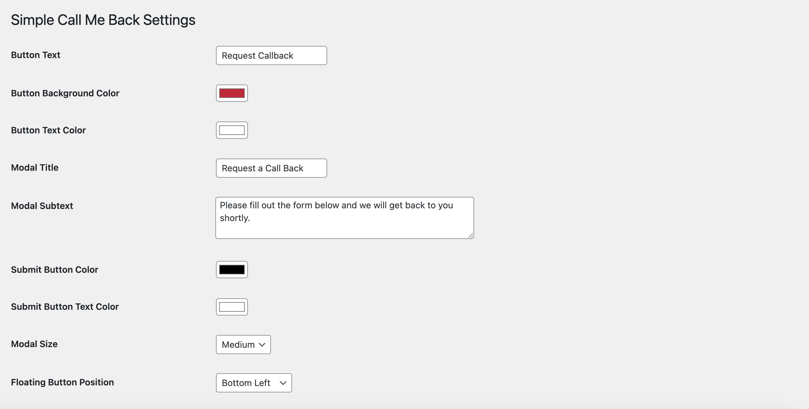

# Lunatec Callback Widget

A simple and customizable WordPress plugin that allows visitors to request a callback via a floating button and a modal form.

## Description

**Lunatec Callback Widget** adds a floating button to your WordPress site. When clicked, it opens a clean, responsive modal form where visitors can leave their name, phone number, and other details to request a call back.

The plugin is designed to be lightweight and easy to configure.

### Features

*   **Floating Request Button**: A customizable floating button that stays visible as users scroll.
*   **Modal Form**: A user-friendly popup form for collecting callback requests.
*   **International Phone Support**: Integrated international telephone input with country flags and codes.
*   **Admin Management**: View all callback requests in a dedicated admin dashboard.
*   **CSV Export**: Easily export all requests to a CSV file for external processing.
*   **Customization**:
    *   Change button text and colors.
    *   Customization of modal title and helpful subtext.
    *   Choose button position (bottom-right, bottom-left, top-right, top-left).
    *   **Fine-tuned Positioning**: Adjust the specific X and Y margins for the floating button.
    *   Set modal size (small, medium, large).
    *   Configure submit button colors.
*   **CRM Integration**:
    *   **HubSpot**: Automatically sync valid callback requests to HubSpot CRM as contacts.
*   **Notifications**:
    *   **Slack**: Send notifications to a Slack channel via Webhook.
    *   **Email**: Receive email alerts for every new request.
*   **Shortcode Support**: Use `[lcbw_callback]` to place a trigger button anywhere on your site.

## Installation

1.  Upload the `lunatec-callback-widget` folder to the `/wp-content/plugins/` directory.
2.  Activate the plugin through the 'Plugins' menu in WordPress.
3.  Go to **Lunatec Callback Widget > Settings** to configure the button appearance and form options.
4.  Go to **Lunatec Callback Widget > Requests** to view submissions.

## Usage

### Automatic Floating Button
By default, the plugin adds a floating button to the bottom-right corner of your site. You can disable this or change its position in the settings.

### Shortcode
You can also place a callback request button inside any post or page using the shortcode:

```
[lcbw_callback_button text="Request a Call" class="my-custom-class"]
```

*   `text` (optional): The text to display on the button.
*   `class` (optional): Additional CSS class for styling.

## Changelog

### 1.0.2
*   **New**: Added Slack and Email notification support.
*   **Improvement**: Added status badges to the admin requests list.

### 1.0.1
*   **New**: HubSpot Integration! You can now sync requests directly to HubSpot CRM.
*   **New**: Added "Margin X" and "Margin Y" settings for precise positioning of the floating button.
*   **Fixed**: Minor styling adjustments.

### 1.0.0
*   Initial Release.

## Screenshots

### Modal Form


### Modal Form Filled


### Settings Page


## Frequently Asked Questions

**Can I change the position of the floating button?**
Yes, you can choose between Bottom Right, Bottom Left, Top Right, and Top Left in the settings page.

**Where is the data stored?**
The data is stored in your WordPress database in a custom table created by the plugin (`wp_lcbw_requests`).

**Does it support international numbers?**
Yes, the input field automatically handles different country codes and formatting.

## Changelog

### 1.0.0
*   Initial release.
*   Added floating button and modal form.
*   Added admin management and CSV export.
*   Integrated international phone input.
*   Added customization options for colors, text, and positioning.
